## 2b消除订单逾期、缩短制造提前期的技巧

排产易具有缩短所制定计划的制造提前期和解除订单逾期的各种各样的功能。让我们实际运用这些功能。

-   准备

在此数据里，只设定了物料A的模版数据。我们稍微扩充一下物料A的模版数据，并且追加物料B、C这2个模版数据。

1.首先，在物料A的工艺产能里，为了向PR工序里追加另一个候补资源，如下所示在使用指令里设定2个资源。

2.接着，让我们追加物料B、C的模版数据。

可以直接输入，但是因为设定内容同物料A相似，所以如果复制物料A的模版构成会更简便。复制物料A的时候，按住Shift右击复制行，再粘贴行。

1.  这样用与物料A相同的模版构成制作出物料B。此后如下所示仅需要动手修正物料B和物料A的不同项目。

1.  同样地，追加物料C，动手修正不同的项目。

5.如图所示，输入10个制造订单。

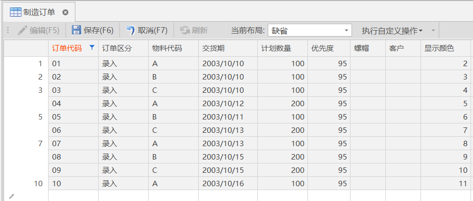

这样就完成了准备工作。以这个排程结果为基础，应用缩短制造提前期和解除订单逾期的各种各样的功能。

### 2b1 确认逾期的制造订单

确认逾期的制造订单。

1.  在资源甘特图上确认重新排程的结果。于是，出现几个逾期的制造订单。

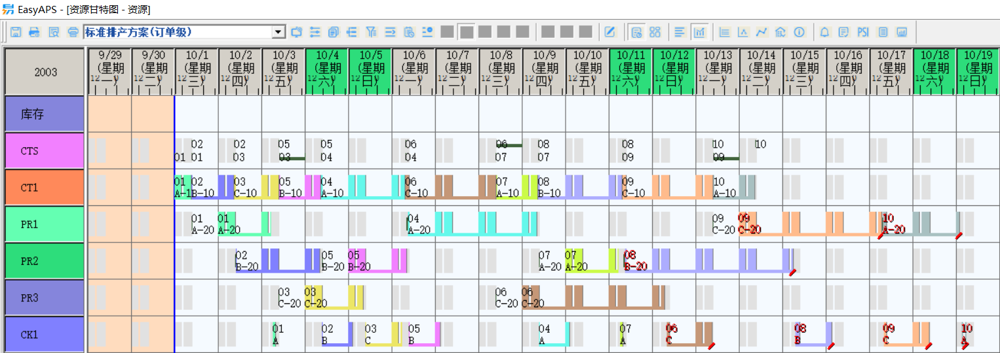

2\. 打开消息窗口，可以看到逾期制造订单数为 5。

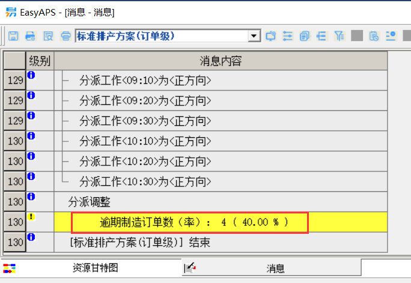

接下来，使用几种功能解除订单逾期、缩短制造提前期。

### 2b2 变更开工时间，解除订单逾期

变更工作时间，试验能否解除订单逾期。

1.  逾期的原因之一是资源 CT1 的工作时间不足，从资源甘特图的分派状态可以看到。因此，增加 CT1 的工作时间看一看。首先在班次表里追加新的出勤模式[S2]。

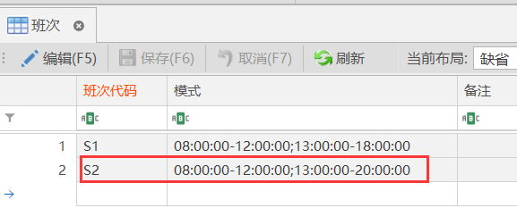

2\. 在生产日历表上追加 CT1 的生产生产时间。

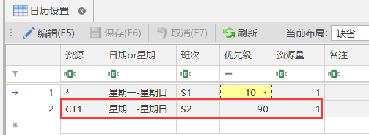

4\. 那么重新排程。在消息窗口可以看到，通过增加资源 CT1 的工作时间使逾期制造订单率从 50%降到 20%。

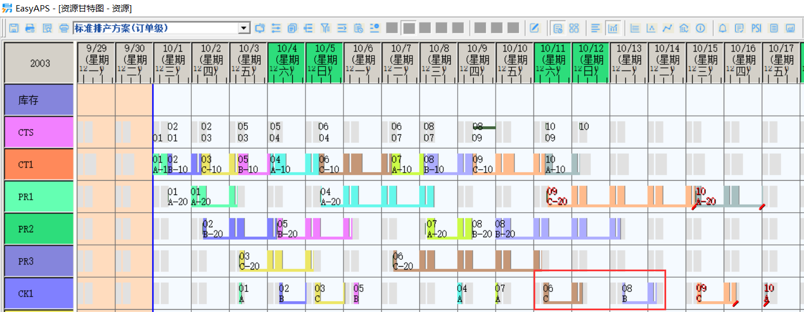

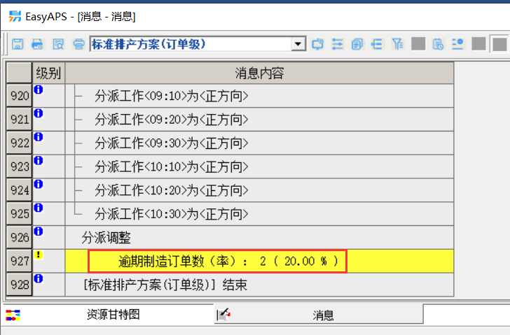

### 2b3 分割制造订单，解除订单逾期

试一试通过分割制造订单，缩短制造提前期、解除订单逾期。

1\. 通过分割制造订单缩短制造提前期。由此解除订单逾期。

2\. 分别将制造数量为 200 的订单 04、06、08、09 分割成数量为 100 的 2 个订单。

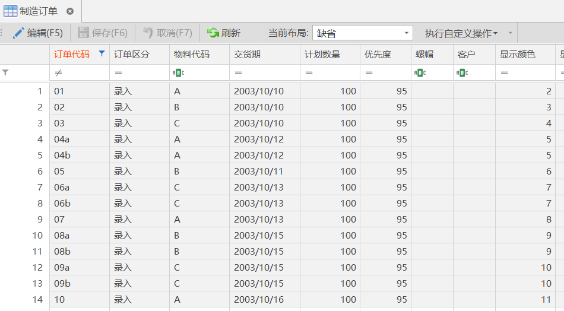

1.  重新排程。

观察重新排程的结果。通过订单分割，制造提前期比上次缩短了，而且对于订单 10的A-20 的工作来说，解除了订单逾期。但是，仍然有未解除逾期的订单。

### 2b4 分割工作，解除订单逾期

试一试通过分割工作，缩短制造提前期、解除订单逾期。通过分割工作使其分派到别的资源上，可以缩短制造提前期。由此，能够减少订单逾期。

1\. 将第 2 道工序的工作全部分割成 2 个，并行分派到 2 个资源上。可以选择要分割的工作，在其属性窗口上设定。分割数量和工作并行数量。但是，在这里我们通过工作表来设定。

2\. 在排产引擎的打开工作表。

3\. 把工序编号[20]的所有工作的工作分割数量和工作并行数量分别设定为[2]、[2]

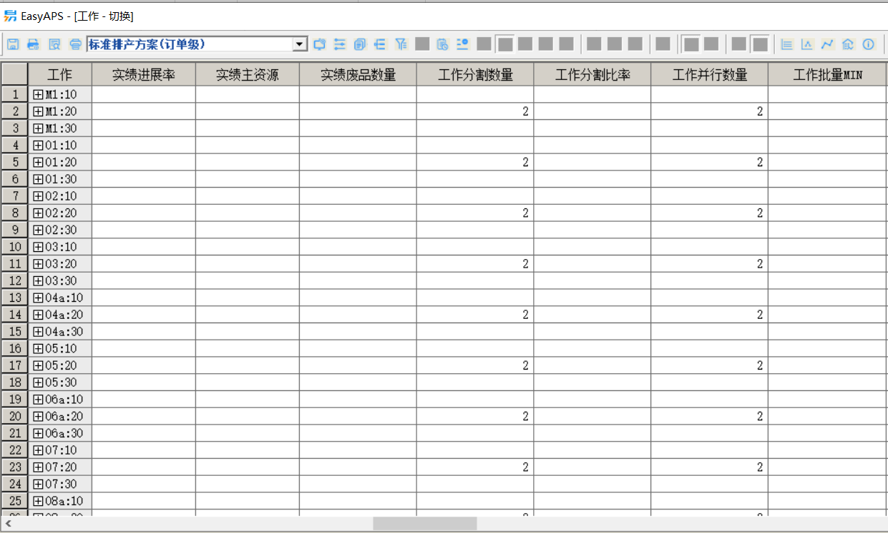

4．重新排程。

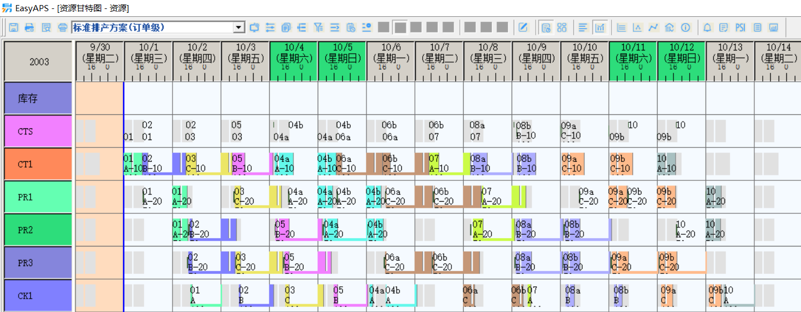

从资源甘特图可以看到分割后的工作分派到了2个资源上。由此，从整体上缩短了制造提前期，解除了订单逾期。

### 2b5 变更接续方法，解除订单逾期

还可以变更接续方法(SSEE, ESE, EES)，缩短制造提前期，解除订单逾期。

为了让前工序和本工序的工作重叠生产而变更接续方法，缩短制造提前期，解除逾期现象。

1.  在2b3的排程结果上，将所有物料的CK工序的接续方法变更为[SSEE]。

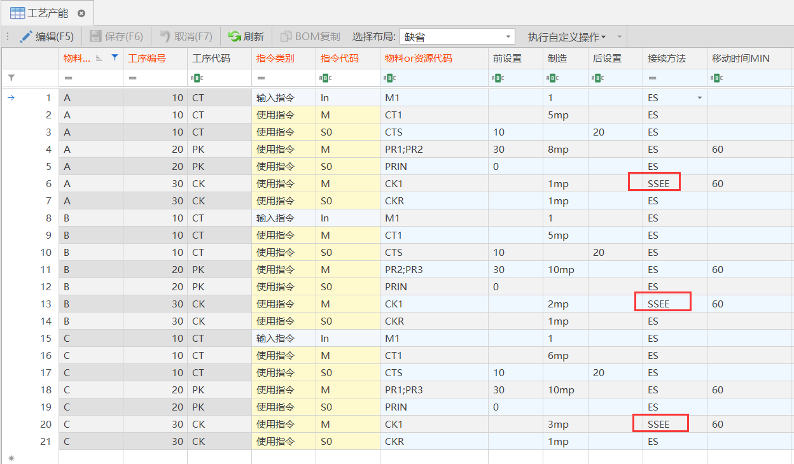

1.  重新排程。

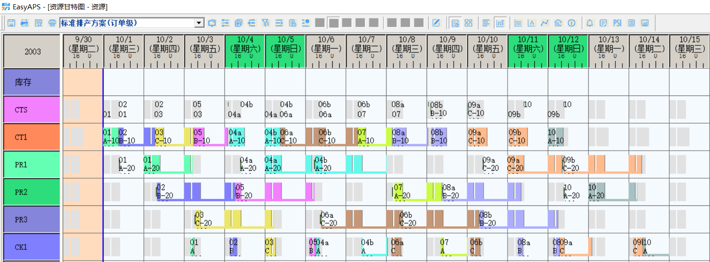

通过将接续方法变更为 SSEE，各工序的工作重叠分派了。由此，缩短了制造提前期，解除了订单逾期。
