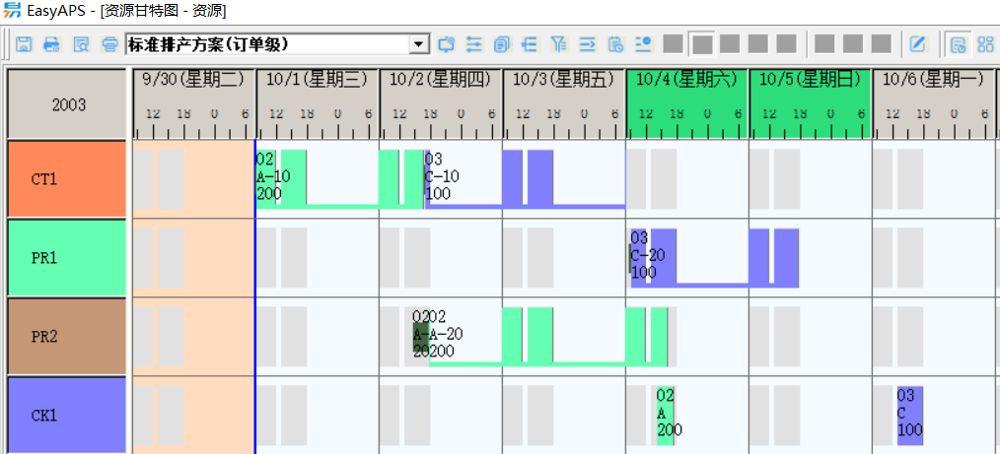
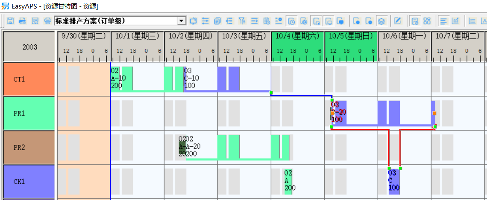
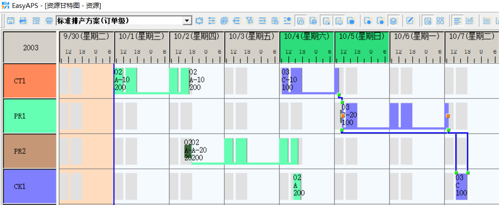
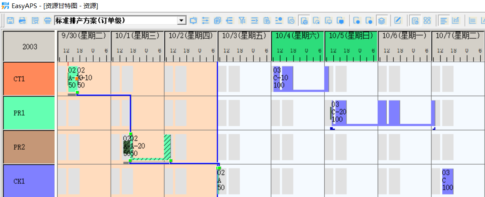

## 2e 与工作相关的各种制约

在这一节中，说明关于工作的分派方向、数量的计算方法等逻辑。

### 2e1 关于时间固定级别的说明以及设定

1\. 时间固定级别。

所有的工作都有时间固定级别，使用该时间固定级别决定工作的分派方向。决定分派方向的基本原则是拉拢时间固定级别小的非固定工作，尽量使制造提前期缩短。

例如，假定订单如下图所示分派。

将订单中的某个工作用鼠标如下图进行移动。

移动后被移动的工作的时间固定级别变为 10。这种状态下重新排程，于是时间固定级别小的工作被拉到时间固定级别大的工作附近。

每个状态的固定级别的缺省值。

| **状态** | **缺省的时间固定级别** |
|----------|------------------------|
| 结束     | 50                     |
| 开始生产 | 40                     |
| 确定     | 30                     |
| 指示完毕 | 20                     |
| 固定     | 10                     |
| 计划完毕 | 0                      |

### 2e2 数量固定级别的说明以及设定

1\. 数量固定级别。

所有的工作都有数量固定级别，使用数量固定级别决定订单内工作的数量。一般来说，以数量固定级别最大的工作为基准计算前后工序的工作数量。

每个状态的数量固定级别默认值。

| **状态** | **缺省的数量固定级别** |
|----------|------------------------|
| 结束     | 50                     |
| 开始开始 | 40                     |
| 确定     | 30                     |
| 指示完毕 | 20                     |
| 固定     | 0                      |
| 计划完毕 | 0                      |

对订单 01 的 CT 工序（02:10）的实绩开始时间设定为2003/09/30 13:00:00。

假设在 PR 工序发生不良品，实绩数量完成了 50 个(设定在第一工序中没有取得实绩)，实绩结束时间为10 月 2 日上午 11 点。

另外，计划基准时间设定为 2003 年 10 月 3 日。

重新排程，于是结果如下。

