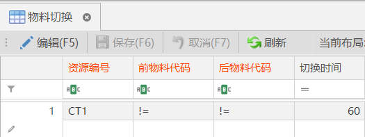
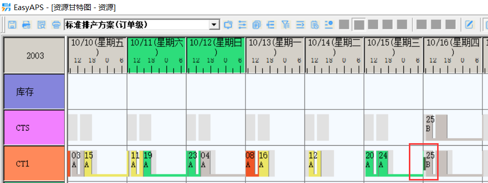
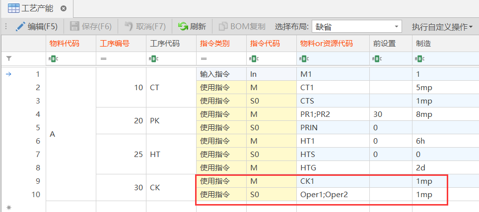
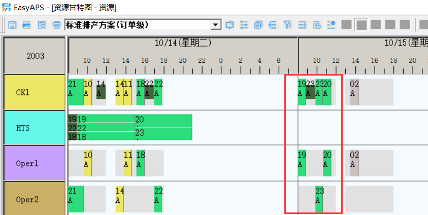
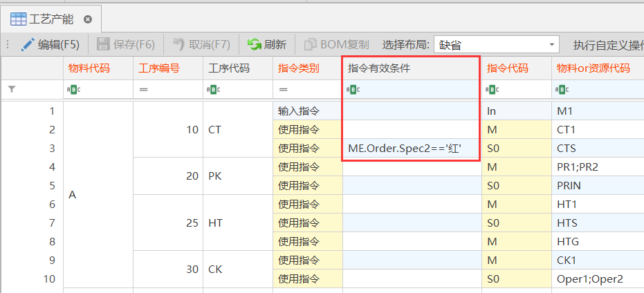
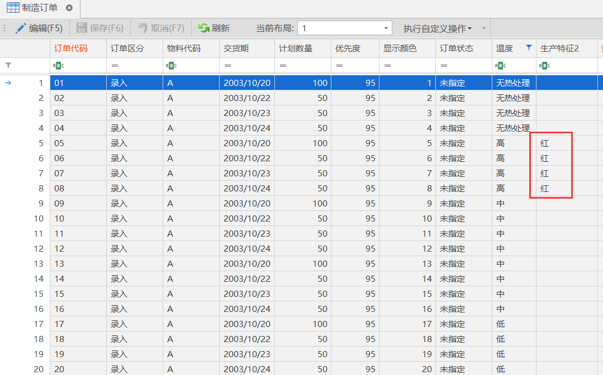
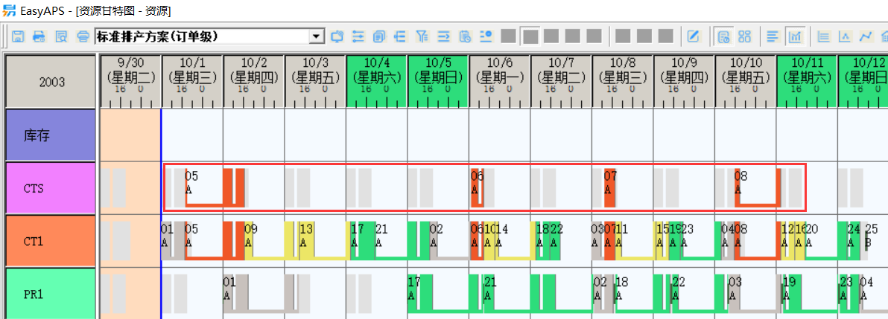

## 2g 数据原型的制作——其它功能

-   继续使用2g的最终数据。

### 2g1 根据规格的分派条件的设定

在上个章节(2f)中，我们完成了热处理的追加。接下来，在下一个工序中根据炉的温度进行资源分派的设定。工序 PR 中有2个资源 PR1、PR2，设定资源 PR1只处理温度为[无热处理」或[低」的工作，而资源PR2只处理温度为[中]或[高]的工作。

1.  将资源 PR1 的规格１设定为[无热处理;低]，资源 PR2 的规格１设定为[中;高]。

    

2.  重新排程，于是温度为[无热处理][低]的工作分派到PR1，[中][高]的分派到PR2上。

### 2g2 由于物料切换、副资源切换而发生的切换时间的设定

在实习 2f4 中实习了由生产特征转换而发生的前后依赖设置时间的设定，制造中的物料进行转换以及使用中的资源进行转换时所发生的设置时间也可以同样进行设定。

1.  设定由于物料转换而发生的前后依赖的设置时间的时候，从菜单打开物料切换表，进行设定。

    1.1设定在资源CT1上，前物料不等于后物料时，切换时间为60分钟。

1.2 重新排程，可以看到在CT1上相同物料切换时间为0，不同物料切换时间为60。

2\. 设定由于资源转换而发生的前后依赖的设置时间的时候，从菜单打开资源切换表，进行设定。

2.1 设定在资源CK1上，副资源Oper1切换到副资源Oper2的切换时间为0。

2.2 重新排程，可以看到副资源Oper1到Oper2的切换时间为60。

### 2g3 使用指令有效条件的设定

实习 2f2 和实习 2f10 中实习了工序选定器有效条件和任务选定器有效条件的设定，使用指令也可以设定同样的有效条件。使用指令有效条件也可以在工艺产能上设定。

例如，想表达[生产特征2]为[红]，就需要配备作业员」的设定，使用任务选定器制作 2 套模板数据也可以，不过在使用指令中设定有效条件表达式，可以减少模板数据的量。

1.在工艺产能设定指令有效条件。

2.在制造订单设定生产特征2。

3.重新排程。可以看到[生产特征2]为[红]的才配备作业员CTS。

